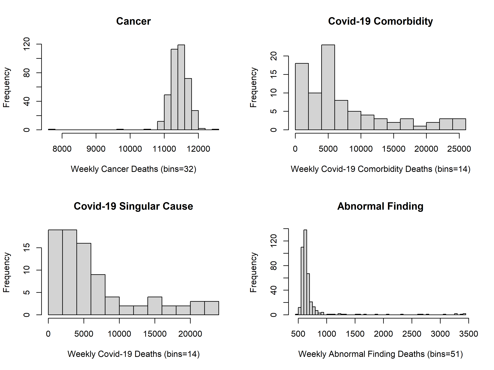
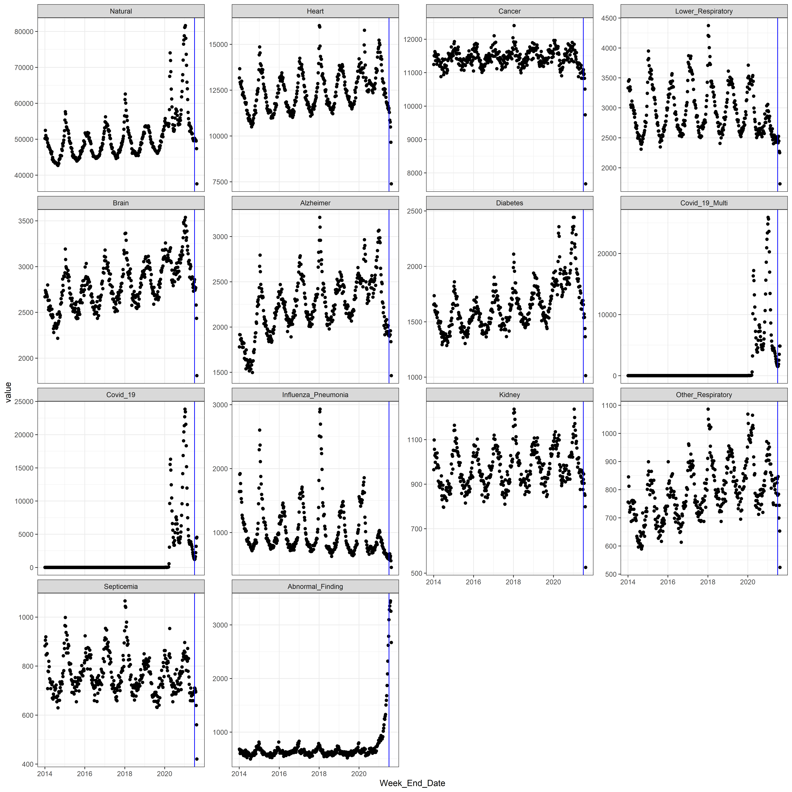

**Note**: Initial data sets were cleaned and merged prior to this analysis. The 
original data sets' structure and cleaning steps may be found in the file 
[us_state_death_trends_wrangling](us_state_death_trends_wrangling.Rmd).

## Introduction and Objectives  

This report explores the Center for Disease Control's (CDC) Weekly Morbidity and 
Mortality data from 2014 through the **------>1st quarter of 2021<--------**. 
**This data analysis is focused on National level weekly death counts for specific 
causes at the United States**. A 2nd report will analyze specific state and local 
regions. The data is voluntary and not guaranteed to be reported in a timely or 
regular basis. Therefore, the most recent data (quarter) will be may be 
incomplete and unreliable for analysis and insights. 

More information on the original data sets can be found at CDC's website using 
the following links: 

- [2014-2015 MMWR Data Set](https://data.cdc.gov/NCHS/Weekly-Counts-of-Deaths-by-State-and-Select-Causes/3yf8-kanr){target="_blank"}
- [2020-2021 MMWR Data Set](https://data.cdc.gov/NCHS/Weekly-Provisional-Counts-of-Deaths-by-State-and-S/muzy-jte6){target="_blank"}

**Note**: The most current data can be downloaded using the links above. To use the 
data sets without any code modifications, the user will need to:

1. Place the data two sets in a subdirectory named "data", and
2. Rename the data sets as "weekly_2014_2019" and "weekly_2020_2021."


```r
# Create United States subset
us_deaths_df <- mmwr_1421_df[Location == "United States", ]

# Dropping unused levels (only United States occurs). 
us_deaths_df$Location <- droplevels(us_deaths_df$Location)
```


## Data Structure  

### Observations and features  

#### Verify United States data set is smooth at merge (2019 to 2020).
#### **Note**: State level data will be verified in individual State analysis.   


```r
# melt(us_deaths_df[ Week_End_Date > as.Date("2019-09-01") & 
#                    Week_End_Date < as.Date("2020-03-31"),
#                    Week_End_Date:Abnormal_Finding],
#      id.vars = "Week_End_Date")


melt(us_deaths_df[ Week_End_Date > as.Date("2019-09-01") & 
                   Week_End_Date < as.Date("2020-03-31"),
                   Week_End_Date:Abnormal_Finding],
     id.vars = "Week_End_Date") %>%
  
  ggplot(aes(x=Week_End_Date, y = value, group=variable)) +
    geom_point() +
    geom_vline(xintercept=as.Date("2020-01-01"), linetype="dotted") +
    facet_wrap(~ variable, scales = 'free_y') + 
    theme_bw()
```


There are vertical gaps (jumps) seen at the intersection of the two data sets 
for: 
- Influenza and Pneumonia
- Other Respiratory
- Abnormal Finding

After the jumps, the data settles into a pattern consistent with the trend of 
the previous years' data. These gaps are likely related to Covid-19 cases that 
were undiagnosed due to Covid-19 testing not being available until March of 2020 
and not being widely available (without restricted use) until May of 2020. In 
addition, there was not a Covid-19 diagnosis of death code available in the 
United States on January 1st of 2020 and therefore any deaths would 
have been diagnosed as another general respiratory category such as these three.

In addition to the gaps, there are notable peaks at the merge point (date) of 
the two data sets. These peaks are generally smooth before and after, indicating 
a local anomaly with a true long-term pattern. 

The analysis will comprise mostly of averages and comparisons of year to year 
descriptive statistics. Therefore, 1-2 week gaps and trends will not effect the 
analysis. 

#### First three observations (chronologically) of the data set.  


```r
head(us_deaths_df, 3)
```

```
##         Location Year Week Week_End_Date Natural Heart Cancer Lower_Respiratory
## 1: United States 2014    1    2014-01-04   50189 13166  11244              3331
## 2: United States 2014    2    2014-01-11   52450 13663  11504              3444
## 3: United States 2014    3    2014-01-18   51043 12928  11496              3333
##    Brain Alzheimer Diabetes Covid_19_Multi Covid_19 Influenza_Pneumonia Kidney
## 1:  2669      1780     1654              0        0                1639    965
## 2:  2738      1917     1735              0        0                1910   1098
## 3:  2714      1914     1660              0        0                1920   1056
##    Other_Respiratory Septicemia Abnormal_Finding
## 1:               756        882              679
## 2:               845        905              665
## 3:               812        919              598
```

#### Last three observations (chronologically) of the data set.  


```r
tail(us_deaths_df, 3)
```

```
##         Location Year Week Week_End_Date Natural Heart Cancer Lower_Respiratory
## 1: United States 2021   27    2021-07-10   46047 10299  10230              2207
## 2: United States 2021   28    2021-07-17   41596  9006   9258              2144
## 3: United States 2021   29    2021-07-24   31341  6715   6927              1611
##    Brain Alzheimer Diabetes Covid_19_Multi Covid_19 Influenza_Pneumonia Kidney
## 1:  2534      1801     1364           1377     1134                 614    874
## 2:  2314      1689     1246           1472     1259                 544    745
## 3:  1737      1333      880           1418     1255                 370    544
##    Other_Respiratory Septicemia Abnormal_Finding
## 1:               794        639             3417
## 2:               650        566             3180
## 3:               443        406             2506
```


```r
str(us_deaths_df)
```

```
## Classes 'data.table' and 'data.frame':	395 obs. of  18 variables:
##  $ Location           : Factor w/ 1 level "United States": 1 1 1 1 1 1 1 1 1 1 ...
##  $ Year               : int  2014 2014 2014 2014 2014 2014 2014 2014 2014 2014 ...
##  $ Week               : int  1 2 3 4 5 6 7 8 9 10 ...
##  $ Week_End_Date      : Date, format: "2014-01-04" "2014-01-11" ...
##  $ Natural            : int  50189 52450 51043 50560 50402 49790 50175 49010 47907 48353 ...
##  $ Heart              : int  13166 13663 12928 12813 12896 12681 12984 12577 12248 12318 ...
##  $ Cancer             : int  11244 11504 11496 11629 11584 11355 11477 11478 11251 11535 ...
##  $ Lower_Respiratory  : int  3331 3444 3333 3467 3283 3351 3303 3047 3008 3043 ...
##  $ Brain              : int  2669 2738 2714 2720 2699 2684 2669 2799 2630 2529 ...
##  $ Alzheimer          : int  1780 1917 1914 1862 1867 1873 1843 1814 1776 1830 ...
##  $ Diabetes           : int  1654 1735 1660 1602 1586 1643 1642 1564 1588 1536 ...
##  $ Covid_19_Multi     : int  0 0 0 0 0 0 0 0 0 0 ...
##  $ Covid_19           : int  0 0 0 0 0 0 0 0 0 0 ...
##  $ Influenza_Pneumonia: int  1639 1910 1920 1765 1642 1528 1472 1269 1228 1215 ...
##  $ Kidney             : int  965 1098 1056 1029 998 1038 1021 973 1018 1040 ...
##  $ Other_Respiratory  : int  756 845 812 753 720 728 739 731 687 760 ...
##  $ Septicemia         : int  882 905 919 845 890 849 851 708 779 777 ...
##  $ Abnormal_Finding   : int  679 665 598 622 664 641 638 643 595 642 ...
##  - attr(*, ".internal.selfref")=<externalptr>
```


After preprocessing and cleaning, the United States (U.S.) subset of data used 
in this analysis accounts for 395 observations and 18 features which includes 
categorical location data, chronological date and week of year information, and 
integer weekly disease death data. The earliest week is the 1st week of January 
2014. The most current as of this analysis is the week ending January 24, 2021. 
Next, is the  data set's summary statistics in the U.S. subset.


#### Summary statistics  


```r
as.data.frame(describeBy(us_deaths_df[ , -"Week_End_Date"]))
```

```
##                     vars   n        mean          sd median     trimmed
## Location*              1 395     1.00000    0.000000      1     1.00000
## Year                   2 395  2017.29367    2.198254   2017  2017.27445
## Week                   3 395    25.78987   15.034779     25    25.62145
## Natural                4 395 50551.41266 6567.181814  49094 49545.39432
## Heart                  5 395 12426.03797 1095.403199  12380 12379.47634
## Cancer                 6 395 11419.98481  356.337880  11429 11437.34700
## Lower_Respiratory      7 395  2939.14684  406.341532   2838  2908.44795
## Brain                  8 395  2803.38228  248.688087   2792  2797.75394
## Alzheimer              9 395  2237.13924  319.193222   2228  2235.93060
## Diabetes              10 395  1640.80759  220.229653   1603  1620.72555
## Covid_19_Multi        11 395  1533.48354 4352.945981      0   345.78549
## Covid_19              12 395  1384.38734 3973.191777      0   299.17035
## Influenza_Pneumonia   13 395  1022.05823  395.156866    865   956.95584
## Kidney                14 395   970.46076   89.787088    961   967.35016
## Other_Respiratory     15 395   791.40759   99.947161    781   787.38170
## Septicemia            16 395   764.53924   80.698224    748   758.89590
## Abnormal_Finding      17 395   716.65570  402.138885    624   633.18612
##                           mad   min   max range        skew     kurtosis
## Location*              0.0000     1     1     0         NaN          NaN
## Year                   2.9652  2014  2021     7  0.04018294 -1.201190987
## Week                  19.2738     1    53    52  0.08414306 -1.184716246
## Natural             4797.6936 31341 81615 50274  2.11060464  6.366299636
## Heart               1177.1844  6715 16020  9305  0.10663693  1.605421646
## Cancer               241.6638  6927 12408  5481 -5.65190984 65.499043336
## Lower_Respiratory    403.2672  1611  4373  2762  0.62120623  0.002147617
## Brain                260.9376  1737  3535  1798  0.11600165  0.414632216
## Alzheimer            302.4504  1333  3212  1879  0.07594168  0.101934972
## Diabetes             195.7032   880  2442  1562  0.92180780  1.444680257
## Covid_19_Multi         0.0000     0 25889 25889  3.58149278 13.418119684
## Covid_19               0.0000     0 23825 23825  3.62269119 13.681400771
## Influenza_Pneumonia  209.0466   370  2930  2560  1.89648600  4.395219812
## Kidney                96.3690   544  1239   695  0.14227646  0.757053264
## Other_Respiratory     94.8864   443  1086   643  0.34360252  0.120944183
## Septicemia            75.6126   406  1066   660  0.54329673  1.282219546
## Abnormal_Finding      54.8562   494  3477  2983  5.15111038 27.704146038
##                              se
## Location*             0.0000000
## Year                  0.1106062
## Week                  0.7564818
## Natural             330.4307774
## Heart                55.1157164
## Cancer               17.9293046
## Lower_Respiratory    20.4452613
## Brain                12.5128556
## Alzheimer            16.0603540
## Diabetes             11.0809564
## Covid_19_Multi      219.0204818
## Covid_19            199.9129741
## Influenza_Pneumonia  19.8824997
## Kidney                4.5176787
## Other_Respiratory     5.0288874
## Septicemia            4.0603683
## Abnormal_Finding     20.2338032
```

#### Summary statistics for Covid features (2020-2021)  


```r
as.data.frame(describeBy(us_deaths_df[ Year > 2019, 
                                       .(Covid_19_Multi, Covid_19)]))
```

```
##                vars  n     mean       sd median  trimmed      mad min   max
## Covid_19_Multi    1 82 7386.902 6956.655   4917 6348.182 5034.168   0 25889
## Covid_19          2 82 6668.695 6411.939   4350 5700.848 4585.682   0 23825
##                range     skew  kurtosis       se
## Covid_19_Multi 25889 1.178376 0.4514839 768.2340
## Covid_19       23825 1.188483 0.4342257 708.0802
```

#### Distributions 2014-2021 (Covid deaths are zero prior to 2020)  


```r
us_deaths_df[ , Natural:Abnormal_Finding]%>%
  hist()
```


#### Distributions 2014-2021 (Covid distibutions are years 2020-2021)  


```r
par(mfrow=c(2,2))

  hist(us_deaths_df[ , Cancer], breaks = 32, 
       main = "Cancer", 
       xlab = "Weekly Cancer Deaths (bins=32)") 
  hist(us_deaths_df[ Year > 2019, Covid_19_Multi], breaks = 14, 
       main = "Covid-19 Comorbidity", 
       xlab = "Weekly Covid-19 Comorbidity Deaths (bins=14)")
  hist(us_deaths_df[ Year > 2019, Covid_19], breaks = 14, 
       main = "Covid-19 Singular Cause", 
       xlab = "Weekly Covid-19 Deaths (bins=14)")
  hist(us_deaths_df[ , Abnormal_Finding], breaks = 51, 
       main = "Abnormal Finding", 
       xlab = "Weekly Abnormal Finding Deaths (bins=51)")
```


```r
par(mfrow=c(1,1))
```


```r
psych::pairs.panels(us_deaths_df[ , Natural:Abnormal_Finding], scale = TRUE)
```




```r
psych::pairs.panels(us_deaths_df[ Year > 2019 , Natural:Abnormal_Finding], scale = TRUE)
```


```r
psych::pairs.panels(us_deaths_df[ Year > 2019,
                                  .(Natural, Heart, Brain, Alzheimer, Diabetes, 
                                    Covid_19_Multi, Covid_19)], 
                    scale = TRUE)
```




# End of file


